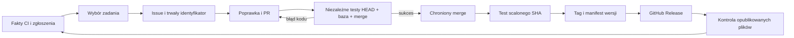

# Ponowny benchmark i gotowość autonomicznego wydawania

```json
{
  "id": "autonomous-delivery-2026-09-10",
  "kind": "analysis",
  "version": 2,
  "date": "2026-09-10",
  "owner": "semcod/gitive",
  "status": "local-uncommitted",
  "source_revision": "b298ba4ef5da37ca24269d38b1f85dc0d7f90826",
  "evidence": [
    "benchmark/runs/20260910T124507Z-delivery-guards/manifest.json",
    "benchmark/runs/20260910T124507Z-delivery-guards/release-audit.json",
    "benchmark/runs/20260910T124507Z-delivery-guards/verification-audit.json",
    "gpt6/tests_github/test_delivery.py",
    "benchmark/runs/20260910T115313Z-3df9cb/manifest.json",
    "benchmark/runs/20260910T115313Z-3df9cb/summary.json",
    "benchmark/runs/20260910T115313Z-3df9cb/release-audit.json",
    "benchmark/runs/20260910T115313Z-3df9cb/verification-audit.json",
    "benchmark/runs/20260910T115313Z-3df9cb/github-readiness.json"
  ]
}
```

## Aktualizacja implementacji — wersja 2

**Zalecenia audytu są wdrożone częściowo.** Wcześniejszy benchmark v2 poprawiał jakość generowania kodu i lokalne wykonanie; nie zamykał braków wydawania. W tej aktualizacji wdrożono dwa odtworzone zabezpieczenia P0 w GPT6, które audyt wskazuje jako podstawę wspólnego kontrolera. Poniższe wyniki pierwotnego benchmarku i obserwacje zdalne zachowano jako historię wersji 1; nie odczytywano ponownie stanu wdrożenia GitHub.

| Zalecenie | Stan po aktualizacji |
|---|---|
| Powiązanie wyniku z repo, PR, HEAD, bazą, merge SHA i profilem testów | Zaimplementowane w resolverze, reporterze, CLI i bramce żądania automerge GPT6; testy offline |
| Test aktualnego wyniku połączenia | Szablon workflow GPT6 pobiera dokładny `merge_sha`; rodzice commita muszą odpowiadać bazie i HEAD |
| Niezmienne wydanie i wznowienie uploadu | Publikator GPT6 rozwiązuje tag do pełnego SHA, porównuje bajty ZIP/checksumy/manifestu, uzupełnia tylko brakujące pliki i ponownie pobiera je do kontroli |
| Powtarzalna paczka | ZIP ma stałe znaczniki czasu i uprawnienia wpisów; retry nie zmienia bajtów tylko wskutek innego checkoutu |
| Niezależny OneDev / Validator i tożsamość wystawcy | Nadal brak potwierdzonego wdrożenia i adaptera chronionej polityki; hash wyniku nie jest podpisem aplikacji |
| Wspólny kontroler z trzema planerami i stanami wydań | Nadal do implementacji; `release_verified` publikatora nie jest jeszcze stanem zadania kontrolera |
| GLM53: pamięć PR, trwały budżet, zdalne repair-base | Nadal do implementacji; ta aktualizacja nie zmienia ścieżki zdalnej GLM53 |
| Opus5: repair → PR, pamięć poza main, wagi i budżet | Nadal do implementacji; ta aktualizacja nie zmienia ścieżki zdalnej Opus5 |
| Wersje semantyczne projektów, izolacja wykonawcy, instalacja opublikowanej paczki | Nadal do implementacji; pozostają techniczne tagi `build-<sha>` |
| Produkcyjny Issue → PR → merge → tag → release | Niezweryfikowany; brak zdalnych operacji w tej aktualizacji |

### Szczegóły zabezpieczeń

Resolver wymaga bieżącej bazy i dwurodzicowego commita połączenia zgodnego z bazą i HEAD. Nieznany wynik połączenia lub konflikt blokuje weryfikację. Reporter wymaga tożsamości zapisanej przed testem i porównuje ją ponownie po teście. Status zawiera skrót krotki, a kontroler przed żądaniem automerge porównuje go z aktualną krotką. Ponowne testy tej samej sprawy po zmianie bazy umożliwiają wznowienie bez nowego issue. Testy używają rzeczywistych obiektów lokalnego Git i atrapy transportu GitHub; syntetyczny commit w atrapie sprawdza tożsamość, nie dowodzi semantyki rzeczywistego merge na serwerze.

Workflow rozdziela proces testu i reportera. Nie jest to wdrożenie lokalnego Validatora ani rozwiązanie izolacji plików hosta. Istniejąca opcjonalna ścieżka żądania automerge nadal wymaga migracji do faktycznej chronionej polityki workspace; w tej sesji nie była wywoływana zdalnie.

Publikator najpierw sprawdza lokalny manifest i checksumę, jawnie tworzy lub weryfikuje tag, następnie uzgadnia draft release. Utrata odpowiedzi po create/upload/edit jest obsługiwana przez ponowny odczyt. Istniejące pliki są porównywane bajtowo przed uzupełnieniem braków; nie używa się `--clobber` ani przesuwania taga. Po publikacji wykonywany jest ponowny odczyt i kontrola plików. To potwierdza transport bajtów, nie instalowalność paczki. Manifest zapisuje SHA źródła i ZIP; nie zawiera jeszcze dowodu niezależnego profilu CI.

`merge_commit_sha` dla otwartego PR reprezentuje testowe połączenie według [API GitHub](https://docs.github.com/en/rest/pulls/pulls#get-a-pull-request). Publikator używa `--verify-tag`, którego znaczenie opisuje [gh release create](https://cli.github.com/manual/gh_release_create); dodatkowo sam porównuje SHA taga i zawartość plików.

### Dowody i status

Nowe wyniki offline: [wydania](../../benchmark/runs/20260910T124507Z-delivery-guards/release-audit.json), [zmiana bazy](../../benchmark/runs/20260910T124507Z-delivery-guards/verification-audit.json). Nie wykonywano nowych zapytań LLM, ponieważ zmiany dotyczą deterministycznej kontroli wdrażania. Historyczny benchmark poprawności kodu nie stanowi testu tych zabezpieczeń.

Przeszło 85 testów integracji GitHub. Po rozszerzeniu macierzy przeszło wszystkich 8 testów `test_delivery.py` (w tym blokada żądania merge po zmianie bazy i wznowienie na tym samym issue) oraz 12 testów plików projektu i pakowania. `compileall` i `git diff --check` przeszły. Manifest przebiegu zawiera SHA-256 zmienionych źródeł i wyniki kontroli.

Źródło bazowe aktualizacji: `9bf5c8618de5b1b1cf7edf93a27394298999381e`. Kod, workflow i raport pozostają lokalne, bez nowego commita, PR lub wdrożenia. Workflow `gpt6/.github/workflows/verify-candidate.yml` był ignorowany przez nadrzędne `.gitignore`; został jawnie objęty lokalnym diffem (intent-to-add), aby dało się go zrecenzować i wersjonować. Pozostałe ignorowane szablony wymagają uporządkowania przy instalacji wariantu; workflow w podkatalogu nie uruchamia głównego repozytorium.

## Historia wersji 1

## Wynik ponownego benchmarku

**Zakończono 27/27 iteracji live. Wszystkie rozwiązania przeszły po 27/27 testów, bez błędów i zaobserwowanych regresji.**

| Rozwiązanie | Zielone etapy | Końcowe testy | Wywołania LLM | Tokeny | Koszt SDK USD |
|---|---:|---:|---:|---:|---:|
| glm53 | 9/9 | 27/27 | 10 | 11361 | 0.025394 |
| gpt6 | 9/9 | 27/27 | 10 | 11578 | 0.022287 |
| opus5 | 9/9 | 27/27 | 12 | 12116 | 0.027175 |

Łącznie 32 wywołania, 35 055 tokenów i 0,074856 USD według metadanych SDK. Poprzednio GPT6 i Opus5 miały po jednym błędzie etapu; teraz oba zakończyły wszystkie etapy poprawnie. Dwa przebiegi nie wystarczają do przypisania poprawy konkretnym zmianom ani do rankingu kosztów i opóźnień.

[Kontrola integralności](../../benchmark/runs/20260910T115313Z-3df9cb/verification.json) potwierdziła niezmienione źródła trzech rozwiązań i kod wykonawczy benchmarku, identyczne wejścia oraz brak nowych regresji przyjętych poprawek. Podczas przebiegu poprawiono tylko opis Opus5 w generatorze raportu i dodano niezależne skrypty audytu.

Ponownie przeszły testy: GLM53 25; GPT6 Python 25, TypeScript 25, crosscheck i GitHub 74; Opus5 17; infrastruktura benchmarku 6.

[Raport live](../../benchmark/runs/20260910T115313Z-3df9cb/report.md) obejmuje ten sam zestaw trzech projektów, kod początkowy i oracle co poprzednio. Każde rozwiązanie otrzymało trzy iteracje na projekt, wspólny model `openrouter/z-ai/glm-5.3`, `reasoning_effort=low`, seed 7, maksymalnie dwa wywołania na iterację i timeout 120 s. To ponownie pomiar rodzimego planowania i walidatorów z lokalnymi adapterami wykonania. Nowe natywne `repair` Opus5 i `refactor --apply` GLM53 nie zastąpiły tych adapterów, aby zachować porównywalność. Nie jest to test wdrożenia GitHub.

## Potwierdzony stan wdrożenia

[Odczyt przez lokalne `gh`](../../benchmark/runs/20260910T115313Z-3df9cb/github-readiness.json) dla `semcod/gitive` w dniu 2026-09-10:

- Główna gałąź: `main`.
- API workflowów zwróciło tylko `pages-build-deployment`.
- API ochrony `main` zwróciło 404 `Branch not protected`.
- Endpoint rulesets zwrócił pustą listę.
- Lista GitHub Releases była pusta; brak zmiennych Actions o nazwach zaczynających się od `INTUITION`.
- W głównym katalogu checkoutu nie ma `.github/workflows`. Pliki w `glm53/.github`, `gpt6/.github`, `opus5/.github` są wariantami projektu, a nie aktywnymi workflowami głównego repozytorium.
- W przeglądanym checkoutcie nie znaleziono profilu chronionego lokalnego Validatora ani konfiguracji OneDev. To luka w dostępnych dowodach, nie stwierdzenie, że usługi nie istnieją poza repozytorium.

Zatem działający lokalny benchmark nie oznacza uruchomionej autonomicznej pętli. GitHub Pages jest osobnym wdrożeniem i nie dowodzi działania napraw, testów ani wydawania trzech projektów.

## Pokrycie obecnych rozwiązań

| Element | GLM53 | GPT6 | Opus5 |
|---|---|---|---|
| Propozycja i wybór zadania | Tak | Tak | Tak |
| Lokalne wykonanie poprawek | Tak, klon i testy | Poprawka GitHub i oddzielna weryfikacja | Tak, nowe `repair` |
| Issue → PR | Implementacja istnieje | Trwały kontroler i odzyskiwanie | Brak połączenia `repair` z publikacją PR |
| Reakcja na nieudane testy PR | `repair_pr` | Kolejne próby i ograniczenia | Brak procesu zdalnego |
| Automerge | Opcjonalne żądanie po sprawdzeniu checków | Opcjonalne żądanie z kontrolą ochrony i SHA | Brak |
| Tag / GitHub Release | Brak | `build-<20 znaków SHA>`, prerelease | Brak |
| Test wynikowego połączenia z aktualną bazą | Brak pełnego powiązania | Brak pełnego powiązania | Brak procesu zdalnego |
| Uruchomienie tego procesu w `semcod/gitive` | Niepotwierdzone | Niepotwierdzone | Niepotwierdzone |

## Dwa dodatkowe defekty odtworzone offline

### P0: wynik weryfikacji nie jest związany z przetestowaną bazą

[Probe](../../benchmark/audit_verification.py) tworzy kandydata przez prawdziwy kontroler GPT6 z lokalnym zastępstwem GitHub, rozwiązuje jego tożsamość, przesuwa bazę, a następnie przekazuje wcześniejszy wynik sukcesu do `report_candidate`.

[Wynik](../../benchmark/runs/20260910T115313Z-3df9cb/verification-audit.json): reporter publikuje status `success` dla niezmienionego HEAD mimo zmiany SHA bazy. Test nie dowodzi, że GitHub scali taki PR przy poprawnej ochronie gałęzi; pokazuje brak kompletnego powiązania wyniku po stronie aplikacji. Obecny workflow testuje HEAD kandydata, a nie wynik jego połączenia z aktualnym `main`.

**Poprawka:** niezależny weryfikator powinien wystawiać wynik dla krotki `(repo, PR, head_sha, base_sha, merge_sha, test_profile_digest)`. Zmiana dowolnego elementu unieważnia poprzedni wynik i wymaga nowej weryfikacji. Merge queue jest alternatywą organizacji takich testów, ale wymaga obsługi zdarzeń grupy merge i odpowiedniego backendu CI. [Dokumentacja GitHub merge queue](https://docs.github.com/en/repositories/configuring-branches-and-merges-in-your-repository/configuring-pull-request-merges/managing-a-merge-queue).

**Test odbioru:** przesunięcie bazy po zielonych testach blokuje merge; po zweryfikowaniu nowego wyniku połączenia proces wznawia się bez nowego issue.

### P0: istniejący release jest akceptowany bez sprawdzenia tożsamości i treści

[Probe wydania](../../benchmark/audit_release.py) uruchamia rzeczywisty `publish_release.py` z atrapą transportu. Istniejący release ma nazwy obu oczekiwanych plików i inne `target_commitish`. Skrypt zgłasza dostarczenie wersji bez odczytania referencji taga ani zawartości artefaktów.

[Wynik](../../benchmark/runs/20260910T115313Z-3df9cb/release-audit.json) potwierdza brak sprawdzenia. Samo `target_commitish` nie dowodzi, gdzie aktualnie wskazuje tag — właśnie dlatego trzeba rozwiązać referencję taga aż do commita.

**Poprawka:** porównać pełne SHA taga, manifest i SHA-256 istniejących plików. Identyczna wersja oznacza no-op; inna zawartość pod tą samą wersją oznacza konflikt, nigdy automatyczne nadpisanie. Tworzyć i sprawdzać tag jawnie przed publikacją; `gh release create --verify-tag` zapobiega jego niezamierzonemu utworzeniu, lecz samo nie zastępuje porównania SHA. [Dokumentacja gh release create](https://cli.github.com/manual/gh_release_create).

**Test odbioru:** zły tag, zły ZIP, brak jednego pliku oraz utrata odpowiedzi po utworzeniu release. Powtórzenie nie tworzy drugiego wydania i nie zmienia wcześniejszej wersji.

## Zalecana architektura autonomii

Najmniejszy zakres prac to jeden wspólny kontroler cyklu życia oparty na GPT6, z trzema wymiennymi mechanizmami planowania. Nie należy uruchamiać trzech niezależnych wydawców na tej samej gałęzi i tych samych zadaniach.



Stan ma rozróżniać `proposed`, `issue_created`, `patch_prepared`, `pr_open`, `verifying`, `verified`, `merge_requested`, `merged`, `release_pending`, `released`, `release_verified`. Każda operacja zapisuje trwały identyfikator i oczekiwane SHA przed przejściem dalej. Restart najpierw odczytuje stan GitHub i uzupełnia przerwaną operację. Sukces testów, merge i publikacja są trzema oddzielnymi wynikami.

Dla tego workspace obowiązuje polityka z `/home/tom/github/semcod/AGENTS.md`: preferowany chroniony wykonawca lokalny OneDev oraz niezależna Validator App. GitHub może przechowywać issues, PR, tagi i wydania. Nie należy zakładać dostępności takiego wdrożenia na podstawie samych deklaracji ani używać konta generującego kod do samodzielnego zatwierdzania merge.

## Konkretne dalsze poprawki

### Wspólne — kolejność wdrożenia

1. **Profil projektu i instalacja kontrolera.** Wybrać monorepo albo osobne repozytoria. Dla każdego projektu zapisać repo, katalog, gałąź bazową, dozwolone pliki, niezmienne testy, wymagane systemy/runtime i sposób pakowania. Obecny launcher GPT6 jest dopasowany do jego struktury; nie jest uniwersalną komendą testów dowolnego projektu.
2. **Niezależna weryfikacja.** Wdrożyć chroniony profil wykonawcy i wystawcę wyników, przypiąć status do aplikacji oraz dokładnej krotki SHA. Testować publiczne API, regresje i instalację paczki w czystym środowisku. Brak testów nie może oznaczać sukcesu. Kod kandydata uruchamiać w odrębnym, jednorazowym środowisku bez dostępu do katalogu kontrolera i jego `.env`; samo wyczyszczenie zmiennych środowiskowych nie izoluje plików hosta.
3. **Wznowienie i idempotencja.** Przetestować przerwanie po utworzeniu issue, push, PR, żądaniu merge, utworzeniu taga i wysłaniu pierwszego artefaktu. Każdy restart powinien kontynuować tę samą operację. Błąd infrastruktury powinien mieć ograniczony backoff, a nie nagrodę/kary za poprawność kodu.
4. **Kontrolowany merge.** Wymagać ochrony gałęzi/rulesetów, niezależnego wyniku i aktualnej bazy. Dodać adapter polityki dla faktycznie wdrożonego lokalnego Validatora. Bez bypass, `--admin` i bez obniżania istniejących wymagań.
5. **Wersjonowanie.** Dla monorepo używać osobnych przestrzeni tagów, np. `glm53/v1.0.1`, `gpt6/v1.0.1`, `opus5/v1.0.1`. Zaufana polityka określa zmianę wersji; domyślna naprawa kompatybilna może podnosić patch, zmiana publicznego API wymaga osobnej kwalifikacji. W manifestach zapisywać pełne SHA commita, wyników testów i artefaktów. Utrzymywać niezmienne wydania.
6. **Obserwacja po publikacji.** Pobrać opublikowaną paczkę, sprawdzić checksumę i test instalacyjny. Dopiero wtedy `release_verified`. W razie regresji tworzyć nowe zadanie naprawcze lub PR wycofujący; nie przesuwać istniejącego taga.

Przy uwierzytelnianiu nie należy zakładać, że push/merge wykonany przez `GITHUB_TOKEN` uruchomi następny workflow. Aktualna dokumentacja opisuje wyjątki dla dispatch i część zdarzeń PR wymagających akceptacji; App token lub jawne zlecenie niezależnemu wykonawcy umożliwia zaplanowanie procesu bez oczekiwania na przypadkową kaskadę zdarzeń. [Dokumentacja GitHub](https://docs.github.com/en/actions/how-tos/write-workflows/choose-when-workflows-run/trigger-a-workflow).

### GLM53

- Połączyć nowy tryb naprawy czerwonej bazy z kontrolerem zdalnym: istniejący workflow nadal uruchamia `refactor --publish`, bez `--repair-base`.
- Utrwalić powiązania task → issue → branch → PR przed kolejną operacją. Obecne tworzenie issue poprzedza push/PR; utrata procesu może pozostawić osierocone zgłoszenie.
- Dodać oddzielny weryfikator zamiast opierać merge wyłącznie na liście dowolnych zielonych checków.
- Przenieść budżet wywołań do trwałej pamięci. Limit klienta w jednym procesie nie ogranicza kosztu kolejnych uruchomień.
- Naprawić obsługę PR pamięci: workflow rozpoznaje wszystkie `intuition/*` jako aktywne, ale naprawa i automerge wybierają tylko `intuition/issue-*`. Otwarty `intuition/memory-*` może zatrzymać dalsze kroki bez własnej ścieżki rozstrzygnięcia.

### GPT6

- Naprawić dwa odtworzone braki: tożsamość wyniku testów oraz weryfikację istniejącego release.
- Uzupełnić kontroler o stany wydania: obecnie merge kończy zadanie, a log CD jest osobną obserwacją. Nie ma gwarancji przejścia konkretnego zadania do zweryfikowanego release.
- Dodać obsługę faktycznej polityki rulesetów/Validatora; obecnie automerge sprawdza klasyczną ochronę gałęzi i nazwę statusu.
- Zastąpić wydania `build-<sha>` świadomą polityką wersji projektu. Zachować takie tagi jako buildy techniczne, jeżeli są potrzebne.
- Rozszerzyć test nazwany pełnym lifecycle: obecnie lokalny test sam ustawia `merged=True`, zamyka issue i dodaje syntetyczny log CD. Nie uruchamia faktycznego publikatora release ani nie sprawdza taga i plików.

### Opus5

- Połączyć `repair` z kontrolerem PR; obecny workflow tworzy issues i zapisuje pamięć, lecz nie wywołuje nowego wykonawcy.
- Przenieść pamięć z bezpośredniego push do chronionej gałęzi na dedykowaną gałąź pamięci lub wersjonowany zapis zgodny z polityką projektu. Obecny `git push` pamięci będzie kolidował z wymaganą ochroną `main`.
- Używać wag sukcesu napraw przy wyborze przyszłych napraw. Nowy plik `.intuition-repair/weights.json` jest oddzielony od wag podejmowania issues, ale samo zapisanie tych wag nie podłącza ich do następnego `cycle`.
- Dodać trwały limit czasu/kosztu/liczby prób i stany oczekiwania na wynik CI. Timeout pojedynczego zapytania nie jest budżetem całej pętli.

## Następny benchmark autonomii

Obok obecnego wyniku poprawności kodu raportować: liczbę zdublowanych issues/PR, liczbę osieroconych operacji, odsetek wznowień po awarii, próby merge bez właściwego wyniku, zgodność tag → commit → paczka, odsetek zweryfikowanych wydań i czas od issue do release.

Wspólna macierz dla trzech mechanizmów: trzy projekty × trzy pełne cykle wersji × awarie w punktach zapisu. Najpierw lokalny Git z transportem testowym, następnie canary na dedykowanym repozytorium z prawdziwym chronionym wykonawcą. Dopiero canary obejmujące aktualną bazę, niezależny wynik i rzeczywisty release potwierdzi działającą autonomię. Benchmark samego generowania patchy tego nie zastępuje.

## Status prac

Przeprowadzono ponowny benchmark LLM, testy regresji, odczyt stanu repozytorium GitHub i dwa lokalne testy diagnostyczne. Nie tworzono zdalnych issues, PR, tagów ani wydań i nie zmieniano ochrony gałęzi. Propozycje dalszej implementacji są rozdzielone od potwierdzonych wyników.
