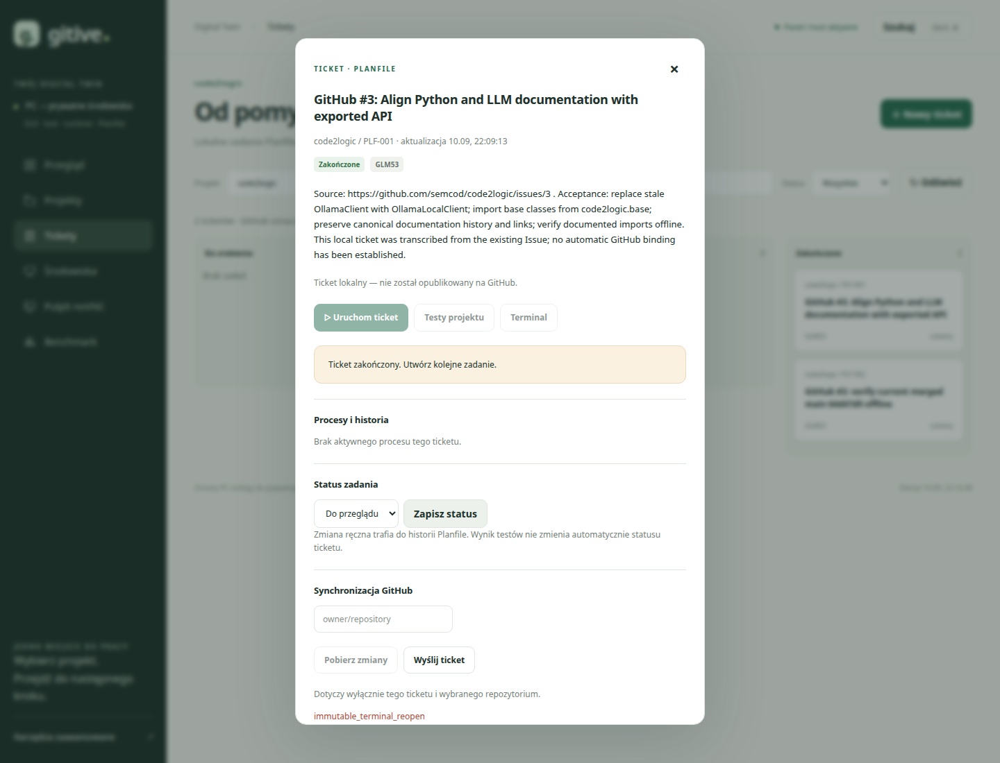

# Próba rzeczywista: Issue code2logic obsługiwane przez Gitive

```json
{
  "id": "code2logic-gitive-2026-09-10",
  "kind": "analysis",
  "version": 1,
  "date": "2026-09-10",
  "owner": "semcod/gitive",
  "status": "completed-with-limitations",
  "source_revision": "196beab67bb40c8c9115d0f4b2f628d9103c302f",
  "ticket": "https://github.com/semcod/gitive/issues/11",
  "target_issue": "https://github.com/semcod/code2logic/issues/3",
  "target_verified_revision": "64d47d9f284e0eb87ac0b1286bb59e5f87a4608c",
  "evidence": ["src/gitive/jobs.py", "src/gitive/develop.py", "src/gitive/planfile_bridge.py", "src/gitive/digitaltwin.py", "docs/assets/code2logic-gitive/acceptance.py", "docs/assets/code2logic-gitive/receipts.json", "docs/assets/code2logic-gitive/ticket.png"]
}
```

## Czy się udało?

**Częściowo. Nie wszystko działa jako autonomiczna realizacja Issue.**
Udało się zarejestrować rzeczywisty projekt, utworzyć dwa lokalne tickety,
przeprowadzić walidację przez Gitive i zamknąć zweryfikowane zgłoszenie przez `gh`.
Nie udało się automatycznie zaimportować istniejącego Issue, przygotować jego
systemowego runtime ani wykonać poprawki Markdown przez silnik napraw.

Istotne odkrycie: [Issue #3](https://github.com/semcod/code2logic/issues/3)
było już naprawione w [PR #4](https://github.com/semcod/code2logic/pull/4),
scalonym **2026-09-10 o 07:14:10 UTC**. Issue pozostało otwarte.
Lokalny PC nadal miał starszy `main` (`670066c`). Wstępna próba odtworzyła więc
problem ze starego checkoutu, a nie brak poprawki na aktualnym GitHub `main`.
Weryfikację zdalnego punktu startowego należało wykonać wcześniej.

Po sprawdzeniu aktualnego `main` zgłoszenie zamknięto **20:16:51 UTC** z komentarzem
wyjaśniającym wcześniejszy merge i wyniki testów. **Nie powstała nowa poprawka LLM
ani nowy PR code2logic.** Próba utworzenia PR została odrzucona, ponieważ zmiany
już były na `main`; odtworzony przy tej próbie zdalny ref usunięto ponownie.
Istniejącą lokalną gałąź i jej worktree zachowano.

| Element | Wynik |
|---|---|
| Host Gitive i wybór wykonawcy | Działają; ranking wskazał `glm53 → gpt6 → opus5` |
| Rejestracja `code2logic` | Utworzona prywatna kopia kodu |
| Lokalne tickety Planfile | `PLF-001` i `PLF-002`, końcowo `done` |
| Import / powiązanie istniejącego GitHub Issue | Nie działa dostępną komendą `sync pull` |
| Pełny runtime zgodny z PC | Nie utworzono; prefiks systemowego Pythona `/usr` odrzucony |
| Automatyczna edycja Markdown | Odrzucona; wykonawca ogranicza zakres do 1–5 plików `.py` |
| Walidacja aktualnego `main` przez Gitive | `already_green`, exit 0, dokładny SHA `64d47d9…` |
| Importy runtime i testy pomocnicze | Importy OK, **47/47 testów**, na interpreterze projektu z PC |
| LLM | **0 wywołań completion w wykonaniach Gitive**; nie oceniono jakości generacji |
| GitHub Issue #3 | **CLOSED** — zamknięte jawnie przez `gh`, nie przez synchronizację Gitive |
| Issue #1 | Pozostawione bez zmian; ma osobny otwarty PR #2 dotyczący polityki publikacji |

## Środowisko i granice próby

- Panel: `http://127.0.0.1:8793/`; host Gitive był aktywny.
- Źródło PC: `/home/tom/github/semcod/code2logic`, HEAD `670066ca7c2383de95c85ab13740a3c34b1d9acb`.
- Kopia Gitive: `/workspace/github/projects/code2logic` w aplikacji,
  `~/.local/share/gitive-isolated/github/projects/code2logic` na hoście.
- Python wybrany z `.venv` projektu: **3.13.7**, `sys.base_prefix=/usr`.
- `project add` korzysta z importu pomijającego m.in. `.venv`, `venv`, `node_modules`
  i `.subactor`. Nie jest to pełny DigitalTwin. Następny etap `twin plan`
  zablokował przygotowanie runtime, dlatego **nie powstał kontener code2logic**.
- Sprawdzenie 47 testów używało hostowego interpretera `.venv/bin/python`,
  ale importowało kod z prywatnej kopii. To pomocniczy odbiór, **nie testy we własnym
  kontenerze projektu**. Włączono `-B`, wyłączono cache pytest i autoload pluginów,
  użyto tymczasowego HOME oraz blokady połączeń sieciowych.
- Oryginalny kod i środowisko PC pozostawiono bez zmian. HEAD i lista wcześniej
  istniejących niezacommitowanych katalogów pozostały takie same. `git fetch`
  odświeżył metadane zdalnych referencji; nie przesunął lokalnego `main`.

## Przebieg i odpowiedzi

### 1. Wybór realnego zadania

```bash
gh issue list --repo semcod/code2logic --state open --json number,title,url
./gitive host status
./gitive rank
```

Odpowiedzi: dwa otwarte zgłoszenia (#1, #3), `Host Gitive: aktywny`,
`Wybrane rozwiązanie: glm53`. Wybrano #3: poprawienie nieaktualnych importów,
kanonicznych ścieżek dokumentacji i weryfikacja bez usług LLM.

W lokalnym worktree znaleziono wcześniej przygotowane commity `389b4f8` i
`3de1e00`. Ich autorstwa nie przypisujemy silnikowi Gitive działającemu w tej próbie.

### 2. Rejestracja projektu i ticketu

```bash
./gitive project add code2logic /home/tom/github/semcod/code2logic \
  --goal 'Resolve semcod/code2logic#3: align documented Python and LLM imports with the exported API; verify without contacting LLM services' \
  --test 'python3 -m pytest tests/test_shared_utils.py -q' --allow docs
./gitive tickets create code2logic --title 'GitHub #3: Align Python and LLM documentation with exported API' \
  --key 'acceptance:semcod/code2logic#3' --description 'Źródło i kryteria odbioru Issue #3' --json
```

Rejestracja: exit 0, komunikat `Pętla: registered` — w tym miejscu etykieta
„Pętla” jest myląca; zarejestrowano projekt. Ticket: `PLF-001`, wykonawca `glm53`.
Pełny opis z URL Issue zapisano lokalnie; nie oznaczało to ustanowienia bindingu GitHub.

Nie użyto `make test` repozytorium jako bramki odbioru: jego receptura kończy się
`|| echo "No tests yet - create tests/ directory"`, co może zamienić awarię pytest
w kod sukcesu. Zastosowano polecenia zwracające rzeczywisty kod testów.

### 3. Próba synchronizacji i klonowania runtime

```bash
./gitive tickets sync code2logic --ticket PLF-001 --repo semcod/code2logic --direction pull
./gitive twin plan code2logic
```

Odpowiedzi, obie exit 1:

```text
Najpierw opublikuj powiązany ticket
Select bounded runtime prefixes, not an entire system
```

`sync` obsługuje własne, wcześniej powiązane tickety. Nie potrafi przyjąć numeru
istniejącego Issue #3. Nie wykonano `push`, ponieważ mogłoby to utworzyć duplikat.
Runtime odrzucono, ponieważ systemowy Python korzysta z `/usr`, a importer wymaga
ograniczonych prefiksów. Nie zastąpiono go innym Pythonem, udając zgodność z PC.

### 4. Pierwsze uruchomienie silnika

```bash
./gitive tickets run code2logic --ticket PLF-001 --json
./gitive project status code2logic
```

Pierwsza odpowiedź miała `status: running`, exit 0. Wynik końcowy był jednak błędem:

```json
{"status":"error","error":"ValueError","message":"Projekt wymaga czystego checkoutu; zapisz istniejącą pracę"}
```

Powód: do prywatnej kopii trafił niezacommitowany katalog
`.intent-t2c-semcod-batch/`. Wyłączono **tylko ten katalog pomocniczy** przez wpis
w prywatnym `.git/info/exclude`; zachowano jego dane. Nie zmieniono exclude ani
kodu oryginału PC. Następny `git status --short` kopii był pusty.

### 5. Test odbioru konkretnego Issue i druga próba

Ogólny test narzędzi pomocniczych nie dowodzi poprawienia dokumentacji. Dlatego
ustawiono w rejestrze Gitive test odbioru oparty na
[skrypcie acceptance.py](../assets/code2logic-gitive/acceptance.py):
kanoniczne pliki, właściwy import Ollama, metadane rewizji, lokalne linki i symbole API.
Użyto Python API `Projects.result` pod blokadą `DigitalTwin.lock`; CLI nie ma
komendy edycji parametrów zarejestrowanego projektu. Zapisano poprzednią konfigurację.

Pierwsza wersja naszego testu błędnie oczekiwała definicji klasy bezpośrednio
w `llm.py`. Kod eksportuje ją przez import z `llm_clients`; poprawiono walidator,
aby uwzględniał re-eksport. **To błąd pomocniczego testu, nie błąd code2logic.**
Poprawiony test na starym HEAD wykazał brak trzech kanonicznych dokumentów.

Ponowne `tickets run` zakończyło się:

```json
{"status":"error","error":"ValueError","message":"Wybierz zakres 1–5 plików Python, do 100k znaków"}
```

Filtr w `develop.py` dopuszcza wyłącznie pliki `.py`; zadanie dotyczące Markdown
zatrzymuje się **przed wywołaniem LLM**. Zmiana wykonawcy nie usuwa wspólnej bramki.

### 6. Jawna interwencja i walidacja wspomagana

W prywatnej kopii, poza silnikiem napraw, wykonano:

```bash
git merge --ff-only 3de1e00ea59e0e13b1748d8e92832c4a0b91b12b
```

Zastosowano istniejącą gałąź przygotowaną wcześniej. Test dokumentacji zmienił wynik
z exit 1 na exit 0. Następne uruchomienie Gitive zwróciło:

```json
{"status":"already_green","solution":"glm53","base":"3de1e00ea59e0e13b1748d8e92832c4a0b91b12b","head":"3de1e00ea59e0e13b1748d8e92832c4a0b91b12b"}
```

Gitive nie wygenerował ani nie zastosował tu poprawki. Wyłącznie sprawdził już
poprawione pliki. Mimo tego lokalny ticket przeszedł do `done`; Issue na GitHub
wciąż było wtedy otwarte i pole `github` ticketu pozostało `null`.

### 7. Importy i testy offline

W oddzielnym procesie z blokadą `socket.connect` sprawdzono importy
`OllamaLocalClient`, `BaseParser`, `BaseGenerator`, pochodzenie modułu z prywatnej
kopii oraz `pytest tests/test_shared_utils.py -q -p no:cacheprovider`.

Pierwszy przebieg: **47 passed**, ale jedna zablokowana próba pobrania cennika
LiteLLM z GitHub. Z tego powodu pomocnicza bramka offline zwróciła exit 1.
Nie było wywołania generacji LLM ani udanego połączenia.

Po ustawieniu udokumentowanej w zainstalowanym module zmiennej
`LITELLM_LOCAL_MODEL_COST_MAP=True` powtórka zwróciła exit 0:

```text
Offline imports OK: OllamaLocalClient, BaseParser, BaseGenerator
47 passed in 0.15s
Blocked network attempts: 0
```

Nie uruchomiono pełnego zestawu testów code2logic ani wszystkich przykładów
wywołujących dostawców LLM. Wynik dotyczy wskazanych importów i 47 testów.

### 8. Próba PR ujawniła, że poprawka już jest scalona

Po wysłaniu istniejącej gałęzi próba `gh pr create --draft` zwróciła:

```text
pull request create failed: GraphQL: No commits between main and ticket/003-intent-code-alignment (createPullRequest)
```

Sprawdzenie historii ujawniło scalony PR #4. `main` na GitHub wskazywał `64d47d9`,
a jego drzewo plików było identyczne z wcześniej zweryfikowanym `3de1e00`.
W prywatnej kopii wykonano `git fetch origin` i `git merge --ff-only origin/main`.
Nie zmieniono lokalnego HEAD źródła PC. Nie tworzono duplikatu PR.
Zdalny ref odtworzony przez nasz push usunięto z warunkiem dokładnego SHA;
commit pozostaje osiągalny z istniejącego GitHub `main`.

### 9. Odbiór aktualnego main, ograniczenie statusów i zamknięcie Issue

Próba ponownego uruchomienia `PLF-001` została prawidłowo odrzucona:

```text
Ticket jest zakończony; utwórz nowe zadanie
```

Formularz WWW pozwalał jednak wybrać `review` dla zakończonego ticketu. Zapis
zwrócił **HTTP 409** z `{"error":"immutable_terminal_reopen"}`. Stan się nie zmienił.
Pierwsza asercja przeglądarkowa oczekująca `review` nie przeszła; ponowny test
potwierdził rzeczywistą odpowiedź 409. To brak dopasowania formularza do reguł Planfile.

Utworzono nowy ticket odbioru `PLF-002` i wykonano go przez Gitive na aktualnym
`64d47d9`. Wynik: `already_green`, testy exit 0, `base == head == 64d47d9`,
bez zmiany kodu i bez wywołania LLM.

Dopiero po tej weryfikacji wykonano `gh issue close 3 --repo semcod/code2logic
--reason completed --comment ...`, z uzasadnieniem opartym na wcześniejszym PR #4
i testach. Odpowiedź odczytu kontrolnego:

```json
{"closedAt":"2026-09-10T20:16:51Z","state":"CLOSED","url":"https://github.com/semcod/code2logic/issues/3"}
```

Zamknięcie wykonał operator przez `gh`. Automatyczna synchronizacja istniejącego
Issue z Planfile nadal nie została zaimplementowana ani potwierdzona.

## Wykonania zapisane przez Gitive

| Run | Ticket | Wynik | Interpretacja |
|---|---|---|---|
| `20260910T200621Z-acbeec` | PLF-001 | error → blocked | Niezacommitowany katalog pomocniczy |
| `20260910T200754Z-efb717` | PLF-001 | error → blocked | Markdown poza zakresem `.py` |
| `20260910T200912Z-a56382` | PLF-001 | already_green → done | Walidacja po jawnej interwencji na 3de1e00 |
| `20260910T201502Z-b32790` | PLF-002 | already_green → done | Odbiór dokładnego GitHub main 64d47d9 |

Pełne wyniki znajdują się w prywatnym `app-data/<run>/develop-1/result.json`.
W żadnym z tych wykonań nie osiągnięto gałęzi wywołującej completion, dlatego nie
powstały transkrypty request/response LLM. `glm53` jest przypisaniem wykonawcy,
a nie dowodem, że model coś wygenerował. Nie przetestowano realnej naprawy
przez GPT6 ani Opus5 na tym Issue.

## Co wymaga poprawy

1. **Punkt startowy z GitHub:** przed wykonaniem porównać lokalny HEAD z aktualnym
   remote, historią PR i stanem Issue. Bez tego stary checkout może odtwarzać już
   naprawiony problem. Nie nadpisywać lokalnych zmian przy uzgadnianiu.
2. **Import istniejących zgłoszeń:** dodać jawne `tickets import --repo --issue`,
   stabilne powiązanie i konfliktowy pull/push bez tworzenia duplikatów.
3. **Runtime systemowy:** obsłużyć projekty oparte na `/usr` przez zweryfikowany
   obraz systemu oraz kopię zależności, z porównaniem dokładnych wersji. Nie kopiować
   bezwarunkowo całego `/usr` i nie ogłaszać zgodności przy zastępczym interpreterze.
4. **Zakres zadań:** wspólna bramka i adaptery muszą obsłużyć Markdown/YAML/konfigurację,
   jeśli mają wykonywać dowolne Issue. Aktualny limit 1–5 `.py` trzeba pokazać przed startem.
5. **Rozdzielenie wyników:** `validation_passed`, `already_satisfied`, `repaired`,
   `awaiting_review` i `delivered` powinny być rozłączne. Zielony test nie dowodzi
   pracy LLM, synchronizacji, PR ani merge.
6. **Preflight testów i Git:** wykrywać maskowanie błędów przez `|| echo`; umożliwić
   wybór katalogów pomocniczych do zachowania poza kontrolą czystości kopii.
7. **Menu zgodne z Planfile:** zamiast oferować niedozwolone `done → review`,
   proponować nowe powiązane zadanie. Pokazywać, czy HTTP tylko przyjął wykonanie,
   czy wykonanie już zakończyło się wynikiem.
8. **Następny rzeczywisty test:** wybrać otwarte, jeszcze niescalone Issue z
   odtwarzalnym błędem; po dostarczeniu importu i adaptera runtime przejść cały
   ciąg Issue → zmiana kodu → testy SHA → PR → niezależny merge. Ta próba tego nie dowodzi.

## Odtworzenie i dowody

[Skrypt odbioru](../assets/code2logic-gitive/acceptance.py) używa wyłącznie stdlib.
Uruchomiony w prywatnej kopii na `64d47d9` powinien zwrócić `passed: true`.
Skrypt nie zastępuje osobnego sprawdzenia importów runtime i 47 testów pytest.

Prywatny katalog `semcod/gitive/.subactor/recovery/code2logic-acceptance/` zawiera
polecenia, czas, kod zakończenia i odpowiedzi 40 zapisanych kroków, poprzednią
konfigurację, wyniki czterech wykonań i pierwszą wersję walidatora.
[Manifest SHA-256](../assets/code2logic-gitive/receipts.json) pozwala powiązać
raport z tymi zapisami bez publikowania roboczych katalogów PC.
Nie wypisano ani nie opublikowano `.env`, kluczy API i tokenów GitHub.



## Stan końcowy

Projekt jest widoczny w WWW i `./gitive project list`; dwa lokalne tickety są
zakończone. Kopia ma aktualny GitHub `main`, a oryginał PC zachował swój HEAD.
Issue #3 zostało zamknięte. Pozostało otwarte Issue #1, którego zakresu nie zmieniano.
**Weryfikacja i uporządkowanie zgłoszenia powiodły się; pełna autonomiczna realizacja
przez Gitive nie powiodła się i wymaga wymienionych usprawnień.**
