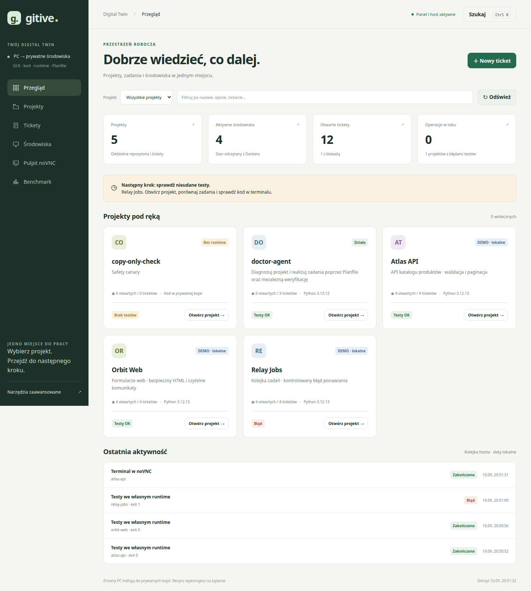
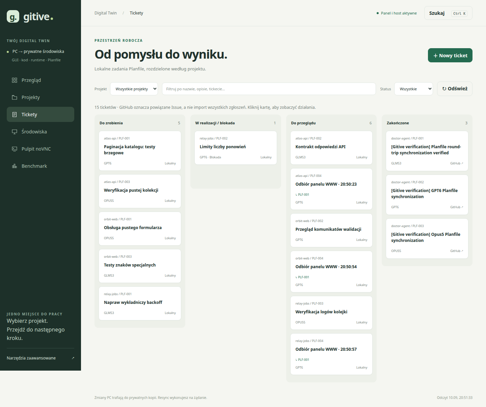

# Odbiór WWW: wiele projektów, workspace i ticketów

```json
{
  "id": "web-workspaces-2026-09-10",
  "kind": "analysis",
  "version": 1,
  "date": "2026-09-10",
  "owner": "semcod/gitive",
  "status": "verified-and-deployed-local",
  "source_revision": "bb84f2d155925ef20561b8ade35881df6ffbfd05",
  "ticket": "https://github.com/semcod/gitive/issues/7",
  "evidence": ["src/gitive/tests/test_control.py", "src/gitive/check_web.py", "src/gitive/demo.py", "docs/assets/web-control/overview.png", "docs/assets/web-control/tickets.png", "docs/assets/web-control/mobile.png"]
}
```

## Wynik

Panel <http://127.0.0.1:8793/> działa z pięcioma zarejestrowanymi projektami,
czterema aktywnymi środowiskami i piętnastoma ticketami. Dodano trzy prywatne
kontenery demonstracyjne oraz dwanaście lokalnych ticketów: dziewięć z seedera
oraz trzy utworzone formularzem WWW podczas odbioru.
Istniejące `doctor-agent`, `copy-only-check`, profile PC i sesje przeglądarek zachowano.



## Rzeczywiste projekty i testy

| Projekt | Ścieżka PC i wewnątrz kontenera | Tickety | Wynik testów przez WWW |
|---|---|---:|---|
| Atlas API | `/home/tom/github/gitive-demos/atlas-api` | 4 | 3/3, exit 0 |
| Orbit Web | `/home/tom/github/gitive-demos/orbit-web` | 4 | 3/3, exit 0 |
| Relay Jobs | `/home/tom/github/gitive-demos/relay-jobs` | 4 | 2/3, exit 1 — kontrolowany błąd |

Każdy kontener ma użytkownika `tom`, HOME `/home/tom`, Python **3.12.13**
i Node **v20.19.5**, skopiowane z wybranych lokalnych prefiksów. Per-projekt venv
oddziela demo od globalnych pakietów Python. Dane w kontenerach są prywatnymi
kopiami; porównanie pełnego inventory źródła po testach potwierdziło brak zmian
w trzech źródłowych repozytoriach. Pliki kodu kopii i PC mają różne inode.
Audyt kontenerów potwierdził mounty prywatnego magazynu i brak Docker socket.

Relay celowo używa liniowego opóźnienia `attempt * 2`, podczas gdy test trzeciej
próby oczekuje wykładniczego wyniku `8`. Wynik `6` daje rzeczywistą awarię widoczną
w panelu. Błąd pozostawiono jako scenariusz demonstracyjny; nie jest awarią testów
samej aplikacji Gitive. Początkowe statusy `review` i `blocked` ustawiono ręcznie
z opisem w historii Planfile; nie są dowodem pracy LLM.

## Sprawdzone zachowanie

- **86 testów aplikacji** przeszło w kontenerze panelu, w tym 7 nowych testów
  API/kolejki: rozdzielenie identycznych ID, zmiana tylko wybranego projektu,
  zachowanie tytułu jako tekstu, rodzic lokalny, brak duplikatów kolejki,
  host offline, brak ponownego wykonania zakończonego wpisu, stała komenda testów,
  odrzucenie wyjścia z prywatnej kopii i ochrona tokenem HTTP.
- Playwright uruchomił Chrome z nowym, tymczasowym profilem i wykonał rzeczywiste
  kliknięcia: wybór trzech projektów, formularz ticketu i rodzica, zapis statusu,
  tablica, wyszukiwanie bez wyników, Ctrl+K oraz zachowanie wyboru po reload.
- Testy uruchomione przez WWW zakończyły się w trzech kontenerach: dwa zielone,
  jeden z kontrolowaną awarią. Akceptacja sprawdza wynik końcowy kolejki, nie samo
  przyjęcie żądania HTTP.
- „Uruchom ticket” jest nieaktywne dla zakończonego ticketu doctor-agent oraz
  projektu wymagającego adaptera runtime P1. Wyjaśnienie jest widoczne przed akcją.
- Przycisk WWW otworzył rzeczywiste okno terminala Atlas w noVNC. Połączenie SSH
  potwierdziło `tom`, oryginalną ścieżkę projektu i HOME. Na pulpicie powstał skrót.
- Sprawdzono widoki 1440 px i 390 px: brak poziomego przepełnienia dokumentu,
  poprawne zawijanie kart i **0 błędów JavaScript**.



[Widok mobilny](../assets/web-control/mobile.png).

Prywatny zapis odbioru: `app-data/web-check-20260910T1900/result.json`,
SHA-256 `17096e8c9fc94134006cb2b0157c4cdc8f00d841c6937be3d159f84ca2774eed`.
W tym samym katalogu jest `isolation.json`. Pełne logi testów pozostają pod
prywatnymi katalogami `github/.digitaltwin/<workspace>/runs/`; raport nie publikuje
profili, sekretów ani surowych logów środowisk PC.

## Wdrożenie i granice

Nowy panel działa jako domyślne `/`, dawny panel pozostaje pod `/tools`.
`gitive-host.service` jest usługą użytkownika z prywatną kopią kodu poza worktree.
Obsługuje trzy jawne akcje z kolejki: testy, terminal, synchronizacja ticketu.
Panel i noVNC pozostają bez Docker socket. `make start` uruchamia także hosta;
`make stop` zatrzymuje panel i hosta, pozostawiając środowiska projektów oraz noVNC.

Ten odbiór **nie wywoływał LLM, nie publikował ticketów demo i nie scalał PR**.
Formularze sync korzystają z istniejącego PlanfileBridge i lokalnego `gh`;
wcześniejszy rzeczywisty round-trip trzech wykonawców pozostaje udokumentowany
w [raporcie integracji Planfile](planfile-doctor-agent-2026-09-10.md).
Naprawa przez GLM53/GPT6/Opus5 w runtime projektu oraz niezależny ciąg
Issue → PR → merge nadal wymagają P1. Wygląd panelu nie stanowi dowodu wdrożenia
tego adaptera.

Zmiany dostarczane są na gałęzi `ticket/007-web-workspaces`, opartej na
`ticket/005-project-terminal`. Lokalny rejestr chronionego Validatora nie ma
profilu semcod/gitive; testy autora i działające wdrożenie nie zastępują niezależnej
walidacji merge. Publikacja obejmuje gałąź i draft PR, bez bezpośredniego merge.

## Dalsze kroki

1. Podłączyć wykonawcę P1 do dokładnie wybranego kontenera, ticketu i SHA;
   wykorzystać trzy demo do odbioru naprawy Relay bez regresji pozostałych projektów.
2. Dodać niezależne zatwierdzanie wyniku, PR oraz tagów po testach tego samego SHA.
3. Rozwinąć podgląd logów o kontrolowane filtrowanie i strumień zdarzeń; aktualnie
   panel pokazuje metadane, a pełny log jest dostępny w prywatnym runtime.
4. Rozwinąć graficzny kreator runtime oraz selector strzałkami w shellu.
   [Instrukcja obecnego panelu](../information/web-control-center.md).
