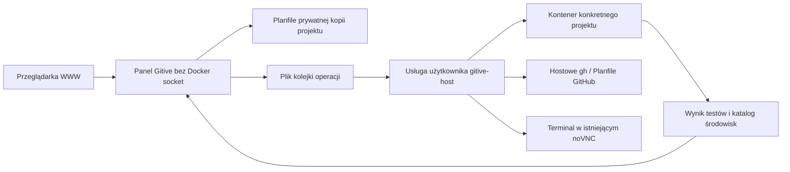

# Centrum projektów WWW

```json
{
  "id": "web-control-center",
  "kind": "information",
  "version": 1,
  "date": "2026-09-10",
  "owner": "semcod/gitive",
  "status": "implemented-local",
  "source_revision": "bb84f2d155925ef20561b8ade35881df6ffbfd05",
  "ticket": "https://github.com/semcod/gitive/issues/7",
  "evidence": ["src/gitive/control.py", "src/gitive/host.py", "src/gitive/control.js", "src/gitive/check_web.py"]
}
```

## Obsługa

Otwórz <http://127.0.0.1:8793/>. **Przegląd** pokazuje liczbę projektów,
obserwowany stan kontenerów, otwarte zadania, kolejkę operacji i następny krok.
Licznik aktywnych środowisk pochodzi z Dockera; zapis „ready” w katalogu sam
nie dowodzi, że kontener działa. Daty są pokazywane w lokalnej strefie przeglądarki.

1. Wybierz projekt z listy lub karty. Wybór jest pamiętany po odświeżeniu strony.
2. Otwórz **Tickety**. Filtruj po nazwie lub statusie; kliknij kartę zadania.
3. **Nowy ticket** zapisuje zadanie w Planfile wybranego projektu. Rodzica oraz
   wykonawcę wybierasz z listy. „Najlepszy według benchmarku” wymaga aktualnego
   kompletnego rankingu; nie zastępuje go arbitralnym wyborem.
4. W szczegółach zmień status, sprawdź operację i historię, otwórz powiązane Issue
   albo zleć `pull`/`push` jednego ticketu przez hostowe `gh`.
5. **Środowiska → Testy** uruchamia zarejestrowane testy w prywatnym kontenerze.
   Wynik zawiera kod zakończenia i czas; pozostaje dostępny po odświeżeniu.
6. **Terminal** otwiera okno w noVNC, połączone przez SSH z konkretnym kontenerem
   jako użytkownik PC i w oryginalnej ścieżce projektu.

`Ctrl+K` / `Cmd+K` wyszukuje projekty i tickety. Tab, Shift+Tab i Enter obsługują
wybór, Esc zamyka okno. Wybór nie wymaga przepisywania ID. Na telefonie menu jest
przewijane poziomo, a karty układają się w dwie kolumny. Treści użytkownika są
renderowane jako tekst; markup w tytule ticketu nie jest wykonywany.

**Narzędzia zaawansowane** pod `/tools` zachowują dotychczasowe formularze
benchmarku, importu, snapshot/clone/resync i profili przeglądarek. Nowy projekt
można również przygotować przez `./gitive project new`, następnie
`./gitive twin prepare NAZWA`. Widok WWW podaje tę komendę, jeśli runtime nie istnieje.

## Architektura i stan



Stan kontrolera to pliki `projects.json`, `digitaltwins.json`, `control-jobs/*.json`
i `runtime-host.json` w prywatnym `app-data`. Tickety należą do `.planfile` każdego
projektu. Identyczny `PLF-001` w dwóch projektach oznacza dwa różne zadania.

Host wykonuje wyłącznie trzy określone operacje: test z rejestru projektu,
otwarcie jego terminala i synchronizację wskazanego ticketu. Żądanie WWW nie
przekazuje arbitralnej komendy shell. Kolejka wykonuje operacje sekwencyjnie;
druga operacja tego samego projektu jest blokowana do zakończenia pierwszej.
Heartbeat jest zapisywany co 5 sekund. Po 20 sekundach bez odczytu panel pokazuje
host offline i stan runtime jako niepotwierdzony. WWW odświeża dane co 4 sekundy.

```bash
make start                 # aplikacja, worker hosta i przeglądarki
./gitive host start        # prywatna kopia kodu + usługa systemd użytkownika
./gitive host status
./gitive host stop
make stop                  # worker + panel; pozostawia noVNC i kontenery projektów
```

Host wymaga dostępnych lokalnie Docker CLI, `gh`, Planfile, filelock oraz dotenv.
`host start` korzysta z aktualnego interpretera CLI. Kopia kodu usługi znajduje się
poza worktree, w prywatnym magazynie Gitive. Aktualizacja usługi jest blokowana,
gdy trwa jej operacja. Restart nie ponawia wpisów zakończonych; poprzednio aktywne
otrzymują status „przerwano”. Przed ponowieniem sprawdź procesy kontenera — sam
restart klienta Docker nie dowodzi zakończenia procesu w kontenerze.

## Granice

- Testy projektu nie są wykonaniem ticketu przez LLM i nie zamykają go automatycznie.
- Zakończony ticket nie może być uruchomiony. Dla projektów z własnym runtime
  adapter napraw GLM53/GPT6/Opus5 pozostaje etapem P1; blokada jest widoczna przed
  kliknięciem. Nie uruchamia się zastępczy Python panelu.
- Synchronizacja dotyczy pojedynczego powiązanego Issue, nie importu wszystkich
  zgłoszeń. Nowe demo nie publikuje niczego na GitHub.
- Pełne logi testów pozostają w prywatnych katalogach runtime; API pokazuje stan,
  czas i exit code. Widok operacji ticketu korzysta z istniejącej telemetrii
  dopasowanej do projektu, ticketu i procesu, nie z domysłów na podstawie tekstu LLM.
- Kontenery mają kopie wybranego runtime, nie wszystkie pakiety całego PC.

## Powtarzalny odbiór

```bash
PYTHONPATH=src python3 -m gitive.demo
PYTHONPATH=src python3 -m gitive.check_web --output /prywatny/katalog/odbioru
```

Seeder tworzy tylko zarządzane demo w `~/github/gitive-demos`, nie nadpisuje obcych
folderów ani istniejących środowisk. Wymaga lokalnego Python 3.12.13 z uv i tworzy
venv per projekt; demo jest narzędziem odbioru tego hosta. Test WWW wymaga Playwright
oraz `/usr/bin/google-chrome`, używa odrębnego tymczasowego profilu Chrome.
Tworzy lokalne tickety odbioru (przy ponowieniu wykorzystuje istniejące), uruchamia
testy trzech kontenerów i otwiera jeden terminal. Wyniki: [raport](../analysis/web-workspaces-2026-09-10.md).
