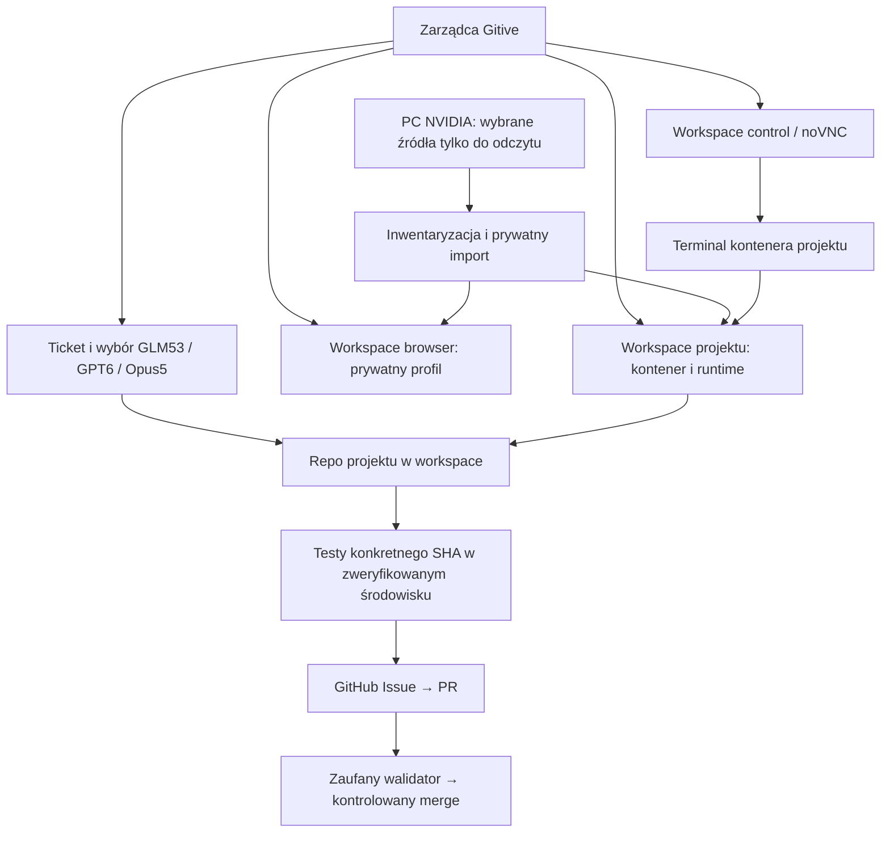

# Gitive: workspace, projekty i tickety

```json
{
  "id": "workspace-project-architecture",
  "kind": "information",
  "version": 1,
  "date": "2026-09-10",
  "owner": "semcod/gitive",
  "status": "architecture-and-scaffold-local",
  "source_revision": "780db4aa186bcc16ebe425391e0a4a0dac056fb4",
  "evidence": ["src/gitive/contracts", "src/gitive/templates", "src/gitive/workspace.py", "src/gitive/develop.py"]
}
```

## Zakres i stan

Dokument definiuje architekturę docelową i dostarczone szablony. Obecny runtime
nadal kopiuje wybrane dane repozytorium i profile offline. Szablony JSON nie są
jeszcze podłączone do provisioningu ani egzekutora GitHub. Nie zmieniono aktywnych
środowisk ani nie utworzono ticketów, Issue lub PR na podstawie tych przykładów.

## Odpowiedzialności

| Obiekt | Co posiada | Za co odpowiada |
| --- | --- | --- |
| Zarządca Gitive | katalog workspace/projektów, kolejka, benchmarki | planowanie, stan, wybór wykonawcy, kontrola wykonania |
| Workspace `control` | środowisko Gitive/noVNC, terminale, narzędzia | dostęp operatora i narzędzia zarządcy |
| Workspace `browser` | wybrana przeglądarka, prywatny profil | sesja przeglądarki, bez wymogu repo Git |
| Workspace `project` | kontener, runtime, prywatne dane, procesy | zgodne środowisko wykonania kodu i testów |
| Projekt | repo Git, src, tests, docs, definicja testów | rozwijany produkt i jego historia |
| Ticket | cel, zakres, kryteria, Issue/PR, SHA, dowody | jedna jednostka realizacji projektu |
| GLM53/GPT6/Opus5 | adapter planowania i napraw | wykonanie ticketu; nie zarządzanie środowiskiem ani zgoda na merge |

Workspace może istnieć bez projektu. Model dopuszcza kilka projektów w workspace,
ale pierwszy etap realizacji używa jednego kontenera na projekt. noVNC udostępnia
terminal do kontenera projektu; nie oznacza uruchamiania wszystkich projektów
w kontenerze przeglądarki. Wybór wykonawcy jest utrwalony na czas ticketu; ponowny
benchmark może zmienić wybór dla kolejnego zadania.



## Struktura kodu zarządcy

```text
src/gitive/
├── cli.py, server.py, index.html, workspace-ui.js   # interfejsy
├── workspace.py, isolation.py                     # obecny import i izolacja
├── projects.py, jobs.py, develop.py                # obecna realizacja projektu
├── engine.py, hub.py                              # benchmark i adapter huba
├── contracts/
│   ├── workspace.schema.json
│   ├── project.schema.json
│   └── ticket.schema.json
├── templates/
│   ├── workspace/workspace.json
│   ├── project/
│   │   ├── gitive.project.json
│   │   ├── src/, tests/, docs/
│   │   └── project/README.md
│   └── ticket/ticket.json
└── tests/
```

Szablony są częścią instalowalnego pakietu. Nie przebudowujemy importowanych repo
według szablonu: zachowujemy ich kod i zasady, a powiązania dopisujemy adapterem.
Główny `project.sh` w tym repo jest historycznym skryptem analizy kodu; nie należy
traktować go jako alokatora ticketów ani bramki publikacji.

## Prywatny magazyn workspace — docelowy układ

```text
~/.local/share/gitive-isolated/
├── app-data/                                      # istniejący stan; migracja zachowuje kopię
├── registry/
│   ├── workspaces/<workspace-key>.json
│   └── projects/<project-key>.json
└── workspaces/<workspace-key>/
    ├── workspace.json                            # deklaracja środowiska
    ├── source-inventory.json                     # wersje i pochodzenie, bez sekretów
    ├── environment/
    │   ├── manifest.json                         # oczekiwane/zaobserwowane wersje
    │   └── verification.json                     # wynik prób uruchomienia
    ├── data/                                     # niezależne pliki projektu
    ├── profiles/                                 # kopie wybranych profili
    ├── snapshots/, backups/                      # wersje importu i przywracanie
    ├── processes/                               # bieżący stan z obserwacji runtime
    └── runs/<timestamp>/                         # logi, testy i dowody operacji
```

To układ docelowy, nie opis już przeniesionych danych. Obecne `github`, `desktop`
i `app-data/workspaces` pozostają aktywne do czasu kontrolowanej migracji.
Rejestracja przechowuje nazwę widoczną dla człowieka; wewnętrzny klucz służy
powiązaniom. CLI i WWW prezentują wybór z datą i godziną, bez wymogu wpisywania ID.

Projekt jest montowany w kontenerze pod pierwotną ścieżką, np.
`/home/tom/github/organizacja/projekt`, ale źródłem mountu jest prywatne `data/`.
W kontenerze projektu nie ma dostępu RW do źródeł PC. Uruchamianie kontenerów
należy do kontrolowanego adaptera hosta/Control; nie dodajemy gniazda Docker do
noVNC ani nie pozwalamy LLM wybierać dowolnych mountów hosta.

## Clone/resync: dane oraz środowisko

1. Operator wybiera źródłowy folder i typ workspace. Dla browser nie wymaga się Git.
2. Inwentaryzacja określa pełną zawartość wybranego folderu, zależności poza nim,
   wersje Python/Node, biblioteki systemowe, symlinki, rozmiar i aktywne procesy.
3. Import kopiuje cały wybrany folder, w tym `.env`, `.git`, `.venv`, node_modules
   oraz zmiany nieśledzone. Pełny import nie oznacza kopiowania wszystkich repo PC.
4. Symlinki i zewnętrzne katalogi nie są dereferencjonowane bez rozpoznania.
   Worktree z zewnętrznym `.git` wymaga eksportu do niezależnego repo z zachowaniem
   commitów i zmian; samo skopiowanie wskaźnika do oryginalnego Git jest niewystarczające.
   Gniazda, pliki urządzeń i otwarte bazy wymagają właściwego adaptera lub blokują import.
5. Provisioner odtwarza wymagane runtime w kontenerze i porównuje wersje oraz testy
   importów. Wersje nieustalone mają `null`/pending, nigdy automatyczne „zgodne”.
   Nie zakłada się zgodności `.venv`, modułów natywnych ani bibliotek CUDA po kopii.
6. Dopiero zweryfikowane środowisko otrzymuje stan ready. Sam schemat JSON nie
   wystarcza: zaufany adapter musi potwierdzić faktyczny obraz i próby uruchomienia.
7. Resync jest jawnym importem PC → workspace: podgląd, zatrzymanie zapisujących
   procesów, blokada konfliktów, kopia poprzedniego stanu, import do staging,
   weryfikacja i atomowe przełączenie. Nie nadpisuje zmian PC ani własnej pracy agenta.

Sekrety pozostają w prywatnych plikach i magazynach. Nie trafiają do obrazu,
benchmarku, promptów, ticketów ani automatycznego `git add`. Profile są danymi
aplikacji, nie zrzutem RAM. Aktywowanie zaimportowanego profilu i wznowienie procesu
są oddzielnymi operacjami, z odrębnym wynikiem w menu.

## Projekt i tickety

```text
repo-projektu/
├── gitive.project.json                    # workspace, testy, polityka wykonawcy
├── src/                                  # kod produktu
├── tests/                                # testy produktu
├── docs/                                 # dokumentacja produktu
├── project/
│   └── ticket-NNN--opis/                  # konwencja przykładowa; decyduje repo
│       ├── ticket.json                    # zakres, kryteria i referencje
│       └── README.md                      # problem, rozwiązanie, wynik
└── .worktrees/ticket-NNN--opis/            # gdy wymaga tego przyjęta polityka repo
```

Dla repo zarządzanego obowiązuje istniejący alokator, rzeczywisty ticket,
worktree i rezerwacja zakresu. Przyjęty układ `<primary>/.worktrees/ticket-NNN--opis`
i gałąź `ticket/NNN-opis` nie mogą być zastępowane przypadkową ścieżką tymczasową.
Przy osobnym kontenerze ticketu jego prywatny checkout może być montowany pod tą
samą ścieżką projektu, utrzymując zgodność ścieżek bez współdzielenia zapisów.
Początkowo wykonanie jest szeregowe: jeden zapisujący ticket na workspace.

Szablon ticketu ma `id: null`: to nie jest alokacja numeru. Nie tworzymy ręcznie
aktywnych `project/ticket-*` z szablonów. Repo bez własnego governance będzie
wymagało alokatora Gitive; jego implementacja pozostaje do wykonania.

### Cykl realizacji

1. Rejestracja projektu i zweryfikowanie jego workspace.
2. Wybór celu, alokacja ticketu, określenie dozwolonych plików i kryteriów odbioru.
3. Obserwacja aktualnego GitHub/base SHA i aktualnego benchmarku; wybór wykonawcy.
4. Utworzenie lub ponowne użycie Issue powiązanego z ticketem, bez duplikowania.
5. Przygotowanie prywatnej gałęzi/worktree, pomiar testów bazowych, implementacja.
6. Testy poprawki w środowisku projektu; związanie wyniku z HEAD, bazą, manifestem
   środowiska, poleceniem testu i raportem wykonawcy.
7. PR, niezależna weryfikacja konkretnego HEAD i wyniku merge z aktualną bazą.
8. Kontrolowany merge przez zaufaną granicę publikacji, ponowny odczyt GitHub.
9. Jeśli projekt wymaga wydania: tag/release związany ze scalonym SHA, wdrożenie
   i kontrola działania. Zamknięcie Issue zgodnie z potwierdzonym wynikiem.

Powtórzenie procesu rozpoznaje istniejące Issue/PR po trwałym powiązaniu; stan
nie jest ustalany wyłącznie z tekstu LLM. Awaria CI jest obserwacją, a nie zgodą
na ominięcie testów. Zmiana HEAD unieważnia poprzednią weryfikację.

Pętla naprawy projektu i pętla ulepszania trzech wykonawców są oddzielne. Gitive
analizuje błąd: problem środowiska trafia do workspace, problem produktu do ticketu,
a potwierdzony problem wykonawcy do osobnego ticketu Gitive. Naprawa wykonawcy
wymaga jego testów i ponownego wspólnego benchmarku bez regresji. Stan kodu
projektu nie zmienia się przy okazji naprawy kontrolera.

## Weryfikacja i dalsze wdrożenie

Schematy i przykłady w pakiecie można sprawdzić przez `make test-contracts`.
Walidacja obejmuje strukturę i podstawowe warunki statusów. Nie weryfikuje podpisu
receiptu, prawdziwości wersji środowiska, relacji między plikami ani stanu GitHub.
Wymagane runtime i etapy migracji opisuje [plan realizacji](../refactoring/workspace-delivery.md).
Bieżące działanie pozostaje opisane w [dokumentacji aplikacji](benchmark-codex-loop.md).

Walidacja: 5 testów kontraktów przeszło; wheel zawiera wszystkie schematy i
szablony (w tym control/browser), a odnośniki dokumentacji są poprawne.
[Zapis weryfikacji](../../benchmark/runs/20260910T150226Z-workspace-architecture/verification.json).
Zmiany lokalne, bez commita, PR ani publikacji.
