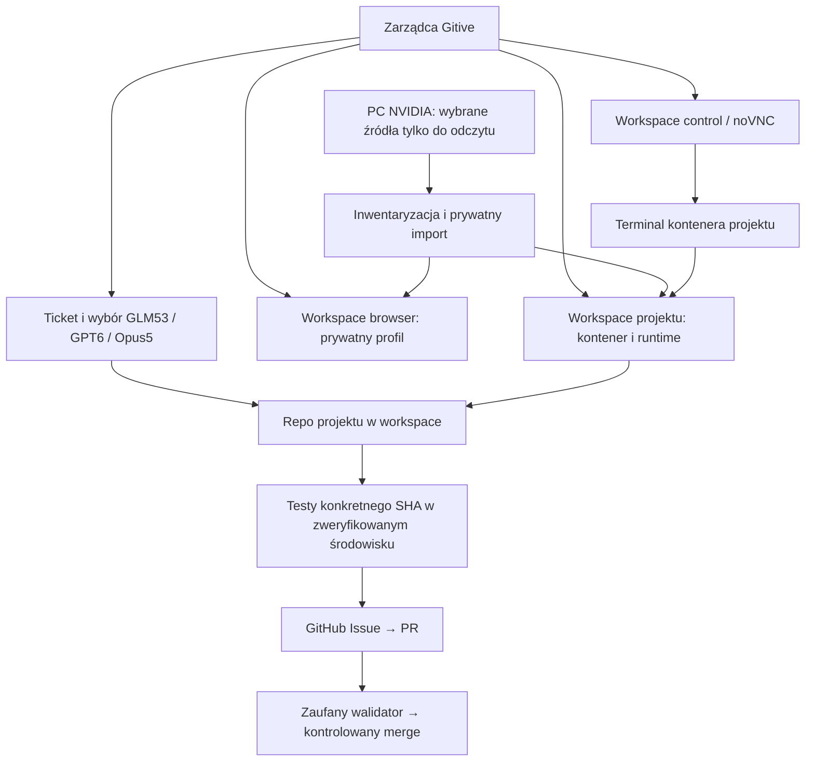

# Gitive DigitalTwin: środowiska, projekty, tickety i wykonania

```json
{
  "id": "workspace-project-architecture",
  "kind": "information",
  "version": 5,
  "date": "2026-09-10",
  "owner": "semcod/gitive",
  "status": "partial-runtime-verified-local",
  "source_revision": "50093fdffa8903e83c522813f89fbcdef209cd02",
  "evidence": ["src/gitive/contracts", "src/gitive/templates", "src/gitive/workspace.py", "src/gitive/develop.py"]
}
```

## Zakres i stan

Dokument rozdziela stan wdrożony od architektury docelowej. Gitive korzysta z
natywnego Store semcod/planfile w `.planfile` każdego projektu. Wspólny adapter
obsługuje GLM53, GPT6 i Opus5 uruchamiane przez Gitive. Synchronizację lokalnych
ticketów z GitHub zweryfikowano na doctor-agent. Prywatne profile PC można
aktywować w noVNC komendą hosta `workspace activate`. Etap P0 dodaje `twin prepare`: pełną kopię wybranego projektu i prefiksów Python/Node, kontener oraz testy pod pierwotnymi ścieżkami. [Dowody](../analysis/planfile-doctor-agent-2026-09-10.md).

## DigitalTwin — model danych

Proponowany model użytkownika jest właściwy jako agregat. Uściślamy relacje:

```text
Gitive (zarządca)
└── DigitalTwin: wybrane środowisko PC i jego prywatne kopie
    ├── control workspace: Docker / Linux GUI / noVNC / wybrane aplikacje
    ├── konta: odniesienia do tożsamości i dostępu, np. GitHub przez lokalne gh
    └── projekty
        ├── repo: prywatna kopia plików + Git + powiązane konto GitHub
        ├── project workspace: środowisko Linux i zgodne wersje zależności
        ├── tickety: natywny magazyn semcod/planfile .planfile
        │   ├── drzewo celu: parent / children
        │   └── graf zależności: blocked_by / blocks, procesy URI depends_on
        └── wykonania: ticket + executor + workspace + SHA + próba + dowody
```

**Projekt posiada kod i tickety, workspace posiada środowisko, a wykonanie wiąże
je w konkretnym czasie.** DigitalTwin jest katalogiem tych obiektów, nie jednym
monolitycznym obrazem Docker. Dzięki temu można zmienić runtime lub odtworzyć
profil bez utraty historii ticketów. Początkowo projekt ma jeden workspace;
docelowo może mieć osobne środowiska developmentu i testów na innych platformach.

Konto GitHub jest odniesieniem `credential_ref`, nie skopiowanym tekstem tokenu
w JSON, obrazie ani ticketach. Dostęp pochodzi z lokalnego `gh`, jest związany
z wybranym kontem i repo; pobranie poświadczenia samo nie oznacza autoryzacji merge.
Aktualna integracja używa konta aktywnego w `gh`; broker kont per workspace
pozostaje do implementacji.

Drzewo opisuje podział celu, natomiast DAG opisuje kolejność wykonania. Przykład:
„testy API” i „testy GUI” zależą od tej samej kompilacji, a PR zależy od obu testów.
Powtórzenia są kolejnymi próbami wykonania węzła, nie cyklem zależności. Planfile
już definiuje parent/children, blocked_by/blocks, TicketExecution i
TicketUriProcess.depends_on; nie tworzymy konkurencyjnego magazynu ticketów.

Nowy [kontrakt DigitalTwin](../../src/gitive/contracts/digitaltwin.schema.json)
i [przykład](../../src/gitive/templates/digitaltwin/digitaltwin.json) określają
katalog i referencje. Publiczny kontrakt określa docelowy format. P0 ma aktywny wewnętrzny katalog
`app-data/digitaltwins.json` z relacjami twin/workspace/projekt/konto; nie jest
jeszcze pełnym schedulerem DAG ani serializacją wszystkich pól kontraktu. Spójność referencji i gotowość wszystkich
workspace musi później sprawdzać resolver katalogu, nie sam JSON Schema.

## Użycie: od menu do konkretnego ticketu

```bash
./gitive menu                  # skrót stanu oraz instrukcja wyboru
./gitive menu 4                # wybór projektu i jego panel działań
./gitive shell                 # numery działają wewnątrz promptu gitive>
./gitive project new           # kreator: folder z ~/github, cel, testy, zakres
./gitive project open doctor-agent
./gitive project status doctor-agent
./gitive tickets list doctor-agent
./gitive tickets show doctor-agent
./gitive tickets create doctor-agent --title "Napraw test X" \
  --description "Test X przechodzi; brak regresji" --engine auto
./gitive tickets run doctor-agent
./gitive tickets sync doctor-agent --repo subactor/doctor-agent --direction push
```

`show`, `run` i `sync` pozwalają wybrać ticket z listy. Opcjonalne `--ticket`
zostaje dla skryptów. `create` generuje klucz automatycznie; `--key` pozwala
powtórzyć ten sam import idempotentnie. `--engine auto` używa aktualnego wspólnego
benchmarku; brak ważnego benchmarku daje instrukcję jego uruchomienia. Można
jawnie przypisać glm53, gpt6 lub opus5. Utworzenie ticketu nie uruchamia LLM.

W Bash samo `4` jest nazwą programu. Użyj `./gitive menu 4` albo wybierz `4`
w `./gitive shell`. Panel projektu pozostaje otwarty po pokazaniu listy;
`0` wraca, a `exit` wychodzi z shella. Kreator importuje istniejące repo PC. W panelu projektu wybierz DigitalTwin,
a następnie plan/prepare/status/test. Nie zakłada to pustego repo ani nowego repo GitHub.

`tickets run` realizuje jeden wskazany ticket istniejącym mechanizmem napraw,
przypisanym wykonawcą, bez zastępowania celu ogólnym celem projektu. Zakończone
tickety i niespełnione zależności blokują start. Wynik `repaired` oznacza wykonaną
próbę i ticket oczekujący weryfikacji. Nie oznacza niezależnego odbioru, PR lub merge.
Mechanizm jest dziś nastawiony na naprawę względem testów; zielony zestaw testów
nie dowodzi wykonania dowolnej nowej funkcji. Ogólny realizator DAG jest w planie.

`project run` / `project watch` pozostają szerszą pętlą celu projektu, która może
uruchomić benchmark i poprawę silników. `tickets run` przy niepowodzeniu zapisuje
wynik do analizy; nie uruchamia automatycznie tej szerszej pętli refaktoryzacji.

### Obserwacja procesów

- `project status NAZWA`: projekt, testy, faza, bieżący ticket, PID lokalnego
  procesu w kontenerze, jego zakończenie i ostatni raport.
- `tickets show NAZWA`: stan ticketu oraz zapisane w Planfile dane wykonania:
  przypisanie, próba, czas rozpoczęcia/zakończenia i odnośnik do wyniku.
- `status` dotyczy wspólnej pętli; `workspace status` dotyczy wyłącznie kopiowania.
- `stop` przerywa lokalny proces roboczy pętli. Operacje wysłane wcześniej do
  zewnętrznego Huba wymagają osobnego potwierdzenia zatrzymania; nie deklarujemy
  zabicia zdalnej sesji na podstawie flagi lokalnej.

Stare tickety mogą nie mieć danych wykonania. Restart ustawia niepewny proces
na `unknown-after-restart`; PID z pliku nie jest dowodem żywego procesu. Wynik
konkretnego ticketu pozostaje w Planfile, nawet gdy wspólny stan pokazuje już inny
projekt. Nie ma jeszcze listy wszystkich procesów GUI i emulatorów per ticket.

## Odpowiedzialności

| Obiekt | Co posiada | Za co odpowiada |
| --- | --- | --- |
| DigitalTwin | odniesienia do workspace, projektów i kont | spójny katalog wybranej kopii PC |
| Zarządca Gitive | katalog workspace/projektów, kolejka, benchmarki | planowanie, stan, wybór wykonawcy, kontrola wykonania |
| Workspace `control` | środowisko Gitive/noVNC, terminale, narzędzia | dostęp operatora i narzędzia zarządcy |
| Workspace `browser` | wybrana przeglądarka, prywatny profil | sesja przeglądarki, bez wymogu repo Git |
| Workspace `project` | kontener, runtime, prywatne dane, procesy | zgodne środowisko wykonania kodu i testów |
| Projekt | repo Git, src, tests, docs, definicja testów | rozwijany produkt i jego historia |
| Ticket | cel, zakres, kryteria, Issue/PR, SHA, dowody | jedna jednostka realizacji projektu |
| GLM53/GPT6/Opus5 | adapter planowania i napraw | wykonanie ticketu; nie zarządzanie środowiskiem ani zgoda na merge |

Workspace może istnieć bez projektu. Model dopuszcza kilka projektów w workspace,
ale pierwszy etap realizacji używa jednego kontenera na projekt. noVNC udostępnia
terminal do kontenera projektu; nie oznacza uruchamiania wszystkich projektów
w kontenerze przeglądarki. Wybór wykonawcy jest utrwalony na czas ticketu; ponowny
benchmark może zmienić wybór dla kolejnego zadania.



## Struktura kodu zarządcy

```text
src/gitive/
├── cli.py, server.py, index.html, workspace-ui.js   # interfejsy
├── navigation.py, planfile_bridge.py              # panel projektu i Planfile
├── capacity.py                                   # kalkulacja budżetu kopii
├── workspace.py, isolation.py                     # obecny import i izolacja
├── projects.py, jobs.py, develop.py                # obecna realizacja projektu
├── engine.py, hub.py                              # benchmark i adapter huba
├── contracts/
│   ├── digitaltwin.schema.json
│   ├── workspace.schema.json
│   ├── project.schema.json
│   └── ticket.schema.json
├── templates/
│   ├── workspace/workspace.json
│   ├── project/
│   │   ├── gitive.project.json
│   │   ├── src/, tests/, docs/
│   │   └── project/README.md
│   └── ticket/ticket.json
└── tests/
```

Szablony są częścią instalowalnego pakietu. Nie przebudowujemy importowanych repo
według szablonu: zachowujemy ich kod i zasady, a powiązania dopisujemy adapterem.
Główny `project.sh` w tym repo jest historycznym skryptem analizy kodu; nie należy
traktować go jako alokatora ticketów ani bramki publikacji.

## Prywatny magazyn workspace — docelowy układ

```text
~/.local/share/gitive-isolated/
├── app-data/                                      # istniejący stan; migracja zachowuje kopię
├── registry/
│   ├── digitaltwins/<twin-key>.json
│   ├── accounts/<account-key>.json                 # odnośniki, bez tokenów
│   ├── workspaces/<workspace-key>.json
│   └── projects/<project-key>.json
└── workspaces/<workspace-key>/
    ├── workspace.json                            # deklaracja środowiska
    ├── source-inventory.json                     # wersje i pochodzenie, bez sekretów
    ├── environment/
    │   ├── manifest.json                         # oczekiwane/zaobserwowane wersje
    │   └── verification.json                     # wynik prób uruchomienia
    ├── data/                                     # niezależne pliki projektu
    ├── profiles/                                 # kopie wybranych profili
    ├── snapshots/, backups/                      # wersje importu i przywracanie
    ├── processes/                               # bieżący stan z obserwacji runtime
    └── runs/<timestamp>/                         # logi, testy i dowody operacji
```

To układ docelowy, nie opis już przeniesionych danych. Obecne `github`, `desktop`
i `app-data/workspaces` pozostają aktywne do czasu kontrolowanej migracji.
Rejestracja przechowuje nazwę widoczną dla człowieka; wewnętrzny klucz służy
powiązaniom. CLI i WWW prezentują wybór z datą i godziną, bez wymogu wpisywania ID.

Projekt jest montowany w kontenerze pod pierwotną ścieżką, np.
`/home/tom/github/organizacja/projekt`, ale źródłem mountu jest prywatne `data/`.
W kontenerze projektu nie ma dostępu RW do źródeł PC. Uruchamianie kontenerów
należy do kontrolowanego adaptera hosta/Control; nie dodajemy gniazda Docker do
noVNC ani nie pozwalamy LLM wybierać dowolnych mountów hosta.

## Clone/resync: dane oraz środowisko

1. Operator wybiera źródłowy folder i typ workspace. Dla browser nie wymaga się Git.
2. Inwentaryzacja określa pełną zawartość wybranego folderu, zależności poza nim,
   wersje Python/Node, biblioteki systemowe, symlinki, rozmiar i aktywne procesy.
3. Import kopiuje cały wybrany folder, w tym `.env`, `.git`, `.venv`, node_modules
   oraz zmiany nieśledzone. Pełny import nie oznacza kopiowania wszystkich repo PC.
4. Symlinki i zewnętrzne katalogi nie są dereferencjonowane bez rozpoznania.
   Worktree z zewnętrznym `.git` wymaga eksportu do niezależnego repo z zachowaniem
   commitów i zmian; samo skopiowanie wskaźnika do oryginalnego Git jest niewystarczające.
   Gniazda, pliki urządzeń i otwarte bazy wymagają właściwego adaptera lub blokują import.
5. Provisioner odtwarza wymagane runtime w kontenerze i porównuje wersje oraz testy
   importów. Wersje nieustalone mają `null`/pending, nigdy automatyczne „zgodne”.
   Nie zakłada się zgodności `.venv`, modułów natywnych ani bibliotek CUDA po kopii.
6. Dopiero zweryfikowane środowisko otrzymuje stan ready. Sam schemat JSON nie
   wystarcza: zaufany adapter musi potwierdzić faktyczny obraz i próby uruchomienia.
7. Resync jest jawnym importem PC → workspace: podgląd, zatrzymanie zapisujących
   procesów, blokada konfliktów, kopia poprzedniego stanu, import do staging,
   weryfikacja i atomowe przełączenie. Nie nadpisuje zmian PC ani własnej pracy agenta.

Sekrety pozostają w prywatnych plikach i magazynach. Nie trafiają do obrazu,
benchmarku, promptów, ticketów ani automatycznego `git add`. Profile są danymi
aplikacji, nie zrzutem RAM. Aktywowanie zaimportowanego profilu i wznowienie procesu
są oddzielnymi operacjami, z odrębnym wynikiem w menu.

## Projekt i tickety

```text
repo-projektu/
├── gitive.project.json                    # workspace, testy, polityka wykonawcy
├── src/                                  # kod produktu
├── tests/                                # testy produktu
├── docs/                                 # dokumentacja produktu
├── project/
│   └── ticket-NNN--opis/                  # konwencja przykładowa; decyduje repo
│       ├── ticket.json                    # zakres, kryteria i referencje
│       └── README.md                      # problem, rozwiązanie, wynik
└── .worktrees/ticket-NNN--opis/            # gdy wymaga tego przyjęta polityka repo
```

Dla repo zarządzanego obowiązuje istniejący alokator, rzeczywisty ticket,
worktree i rezerwacja zakresu. Przyjęty układ `<primary>/.worktrees/ticket-NNN--opis`
i gałąź `ticket/NNN-opis` nie mogą być zastępowane przypadkową ścieżką tymczasową.
Przy osobnym kontenerze ticketu jego prywatny checkout może być montowany pod tą
samą ścieżką projektu, utrzymując zgodność ścieżek bez współdzielenia zapisów.
Początkowo wykonanie jest szeregowe: jeden zapisujący ticket na workspace.

Szablon ticketu ma `id: null`: to nie jest alokacja numeru. Nie tworzymy ręcznie
aktywnych `project/ticket-*` z szablonów. Numery ticketów przydziela natywny Store semcod/planfile w `.planfile`.
Adapter Gitive nie zastępuje istniejących zasad governance i publikacji repo.

### Cykl realizacji

1. Rejestracja projektu i zweryfikowanie jego workspace.
2. Wybór celu, alokacja ticketu, określenie dozwolonych plików i kryteriów odbioru.
3. Obserwacja aktualnego GitHub/base SHA i aktualnego benchmarku; wybór wykonawcy.
4. Utworzenie lub ponowne użycie Issue powiązanego z ticketem, bez duplikowania.
5. Przygotowanie prywatnej gałęzi/worktree, pomiar testów bazowych, implementacja.
6. Testy poprawki w środowisku projektu; związanie wyniku z HEAD, bazą, manifestem
   środowiska, poleceniem testu i raportem wykonawcy.
7. PR, niezależna weryfikacja konkretnego HEAD i wyniku merge z aktualną bazą.
8. Kontrolowany merge przez zaufaną granicę publikacji, ponowny odczyt GitHub.
9. Jeśli projekt wymaga wydania: tag/release związany ze scalonym SHA, wdrożenie
   i kontrola działania. Zamknięcie Issue zgodnie z potwierdzonym wynikiem.

Powtórzenie procesu rozpoznaje istniejące Issue/PR po trwałym powiązaniu; stan
nie jest ustalany wyłącznie z tekstu LLM. Awaria CI jest obserwacją, a nie zgodą
na ominięcie testów. Zmiana HEAD unieważnia poprzednią weryfikację.

Pętla naprawy projektu i pętla ulepszania trzech wykonawców są oddzielne. Gitive
analizuje błąd: problem środowiska trafia do workspace, problem produktu do ticketu,
a potwierdzony problem wykonawcy do osobnego ticketu Gitive. Naprawa wykonawcy
wymaga jego testów i ponownego wspólnego benchmarku bez regresji. Stan kodu
projektu nie zmienia się przy okazji naprawy kontrolera.

## Weryfikacja i dalsze wdrożenie

Schematy i przykłady w pakiecie można sprawdzić przez `make test-contracts`.
Walidacja obejmuje strukturę i podstawowe warunki statusów. Nie weryfikuje podpisu
receiptu, prawdziwości wersji środowiska, relacji między plikami ani stanu GitHub.
Wymagane runtime i etapy migracji opisuje [plan realizacji](../refactoring/workspace-delivery.md).
Bieżące działanie pozostaje opisane w [dokumentacji aplikacji](benchmark-codex-loop.md).

Walidacja: 5 testów kontraktów przeszło; wheel zawiera wszystkie schematy i
szablony (w tym control/browser), a odnośniki dokumentacji są poprawne.
[Zapis weryfikacji](../../benchmark/runs/20260910T150226Z-workspace-architecture/verification.json).
Zmiany lokalne, bez commita, PR ani publikacji.

## Pojemność i rozmiar DigitalTwin

Przyjmujemy regułę użytkownika: dodatkowo zachowujemy wolną przestrzeń równą
jednej kopii DigitalTwin. Decyzja używa **dodatkowej szczytowej alokacji**, a nie
sumy logicznych rozmiarów Docker images i współdzielonych warstw.

`wymagane wolne = nowe dane + staging + pobierane warstwy + rezerwa jednej kopii`.
Elementy już istniejące nie są doliczane ponownie. Jeżeli aktualny twin ma 30 GB,
nowa operacja potrzebuje 30 GB i wolne jest 60 GB, operacja mieści się w budżecie;
nie pokazujemy ostrzeżenia ani pytania. Dla większej rzeczywistej alokacji
pokazujemy konkretny niedobór. Wartości muszą używać tych samych jednostek.

`capacity.assess` oraz test granicy 30/60 GB implementują obliczenie. Plan/prepare używa oszacowania nowych danych i rezerwy; ciągły pomiar
szczytowej alokacji podczas operacji pozostaje do rozwinięcia. Preferowane są niezależne kopie reflink/COW, warstwy tylko do odczytu,
wolumeny danych i zachowane backupy; nie hardlinki do zapisywalnych oryginałów PC.

## Historia wersji

- v1: podział workspace/projekt i szablony.
- v2: wspólny adapter Planfile i aktywacja profili noVNC.
- v3: agregat DigitalTwin, DAG operacji, menu projektu, uruchamianie ticketu,
  stan procesu i reguła pojemności; provisioning i pełny delivery nadal planowane.

Dowody tej aktualizacji: [subactor/search, rewizje źródeł i testy CLI](../../benchmark/runs/20260910T154643Z-digitaltwin-design/verification.json).

## Etap P0 — prywatny runtime projektu

Polecenia hosta: `twin plan`, `twin prepare`, `twin status`, `twin test`,
`twin exec`, `twin recover`; każde przyjmuje nazwę projektu. `prepare`:

1. Sprawdza pojemność i blokuje równoczesne uruchomienie pętli projektu.
2. Wykrywa venv oraz jego base_prefix, wersję Python i prefiks NVM Node.
3. Kopiuje pełny projekt i całe wybrane prefiksy. Każde drzewo jest sprawdzane
   po SHA-256, trybach plików i symlinkach; sekrety nie są interpretowane.
4. Tworzy obraz Ubuntu z narzędziami systemowymi, utrwala ID obrazu i montuje
   tylko prywatne kopie. Projekt jest RW, prefiksy runtime RO, HOME prywatny.
5. Sprawdza wersje i ścieżki interpreterów oraz mounty kontenera. Następnie
   zachowuje aktywny magazyn Planfile i aktualizuje katalog/projekty z backupem.

Aktualny układ P0:

```text
~/.local/share/gitive-isolated/
├── app-data/digitaltwins.json              # relacje i zaobserwowane środowisko
├── app-data/projects.json                  # kompatybilny indeks projektu
├── app-data/catalog-backups/<workspace>/   # poprzednie rejestry
└── github/.digitaltwin/<workspace>/
    ├── operation.json, inventory.json      # stan importu i hashe źródeł
    ├── rootfs/home/tom/...                 # niezależne pełne kopie
    ├── home/                              # prywatny HOME kontenera
    └── runs/<timestamp>/                   # wynik testów i prywatny log
```

Kopiowane symlinki zachowują oryginalną treść. Ich dostępność w kontenerze
zależy od jawnie skopiowanych prefiksów; nie otwierają dostępu do dysku PC.
Brak zależności ujawnia próba wersji lub test projektu, a nie domniemany sukces
kopii. P0 nie odtwarza wszystkich usług, sterowników i pakietów systemowych PC.

Nowy runtime nie jest jeszcze podłączony do `develop.py`: dla projektu z
`workspace_ref` `project run/watch` odmawia użycia Pythona aplikacji. Właściwy
odczyt/test to `twin status/test`. To jawna granica etapu P0; podłączenie trzech
silników i testów ich tymczasowych checkoutów jest osobnym zadaniem P1.

`capacity.assess` jest podłączone do plan/prepare. Kopia dodatkowych danych
oraz rezerwa rozmiaru docelowego twin muszą zmieścić się na dysku; plan uwzględnia
również 1 GiB przewidywanej alokacji obrazu. To oszacowanie, nie rezerwacja miejsca
na poziomie systemu plików. Źródła o zmieniających się danych przerywają import;
nie wymuszamy resync oryginałów PC.

- v4: działający P0 catalog/provisioning/exec/test/recover i jawna granica P1.

## Shell jako widok wykonania

[Shell kontekstowy](context-shell.md) zachowuje `username/project/ticket/operation>`.
Projekt i lokalny ticket Planfile wybiera się z listy. Operacja pochodzi z rejestru
wywołań rzeczywistych funkcji wykonawcy, powiązanego z run ID i PID procesu.
Serwer porównuje projekt, ticket, wykonawcę i proces przed pokazaniem aktywnego
etapu. Brak obserwacji oznacza `unknown`, zakończona praca `idle`, restart
`interrupted`, utrata połączenia `offline`. Nazwa operacji nie jest stanem ticketu:
`done` po synchronizacji zamkniętego Issue nie stanowi dowodu wykonania naprawy.
